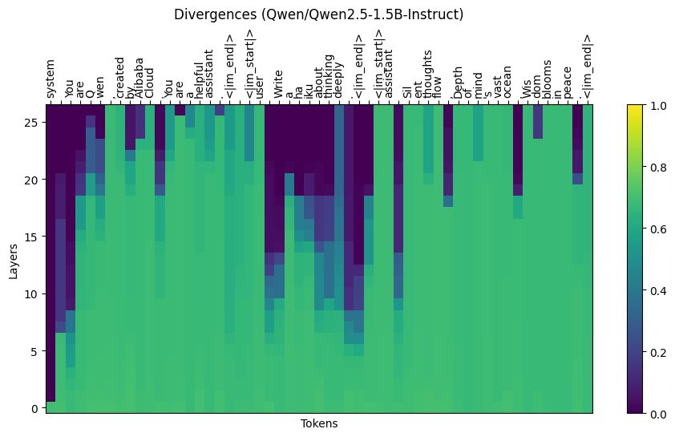

# Deep Think Tokens

Track deep thinking tokens and logit lenses in transformer models.



## About

This is an implementation of the paper ["Think Deep, Not Just Long: Measuring LLM Reasoning Effort via Deep-Thinking Tokens"](https://arxiv.org/abs/2602.13517) by Chen et al.

**Deep-thinking tokens** are tokens where internal predictions undergo significant revisions in deeper model layers prior to convergence.
The **deep-thinking ratio** (proportion of deep-thinking tokens in a generated sequence) exhibits a robust and consistently positive correlation with accuracy on reasoning tasks, substantially outperforming length-based and confidence-based baselines.

Key applications include:
- **Reasoning quality prediction**: Better than raw token counts for measuring reasoning effort
- **Think@n**: Test-time scaling strategy that prioritizes samples with high deep-thinking ratios (DTR)
- **Early rejection**: Enable early rejection of unpromising generations based on low DTR, reducing inference costs

## Installation

```bash
pip install deep-think-tokens
```

Or install directly from GitHub:

```bash
pip install git+https://github.com/maxzuo/deep-think-tokens.git
```

## Example Usage

```python
from deep_think_tokens import (
    add_deep_thinking_tokens_hooks,
    plot_divergences,
    deep_thinking_ratio,
)
from transformers import AutoModelForCausalLM

# Load a model
model = AutoModelForCausalLM.from_pretrained('Qwen/Qwen2.5-1.5B-Instruct')

# Or add hooks for deep thinking tokens
tracker = add_deep_thinking_tokens_hooks(model)

# Generate text and collect divergences
# ...

# Collect results
results = tracker.collect()

# Plot divergences
plot_divergences(results, tokens=['token1', 'token2', ...])

# Calculate deep thinking ratio
dtr = deep_thinking_ratio(results, g=0.5, p=0.9)
```
